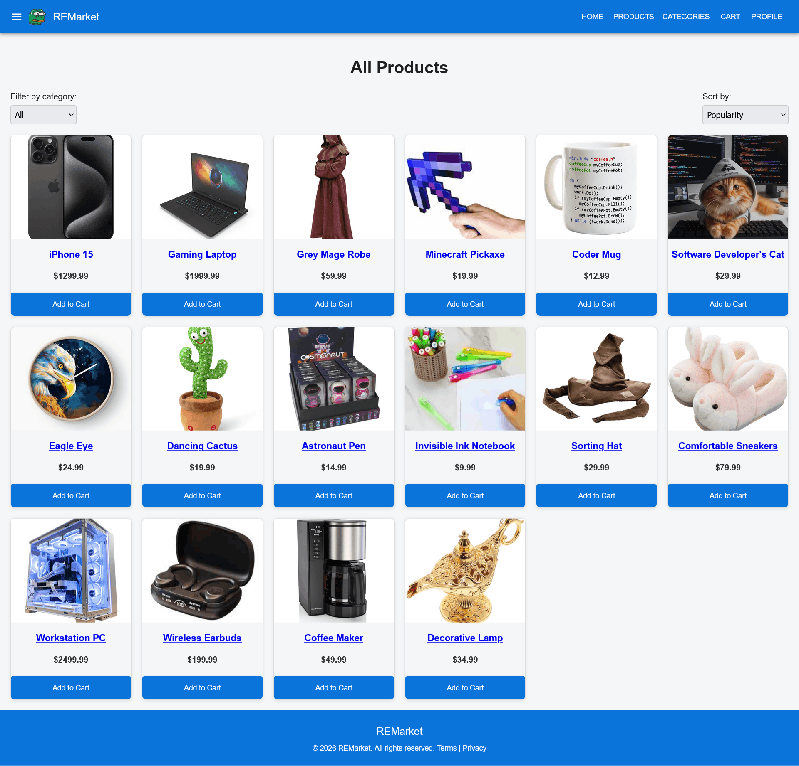
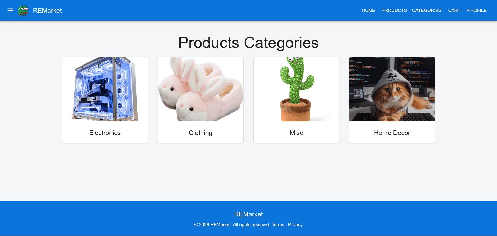
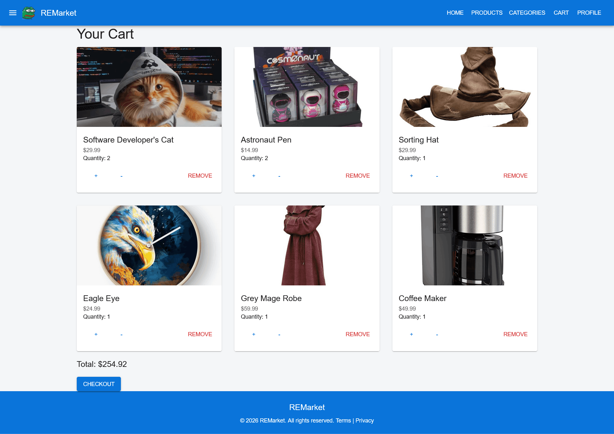
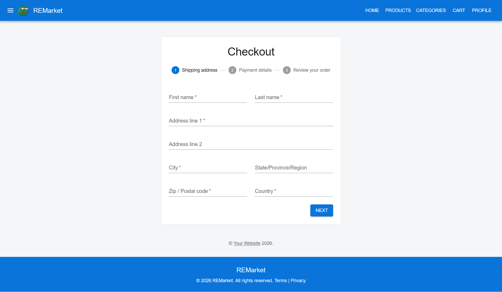
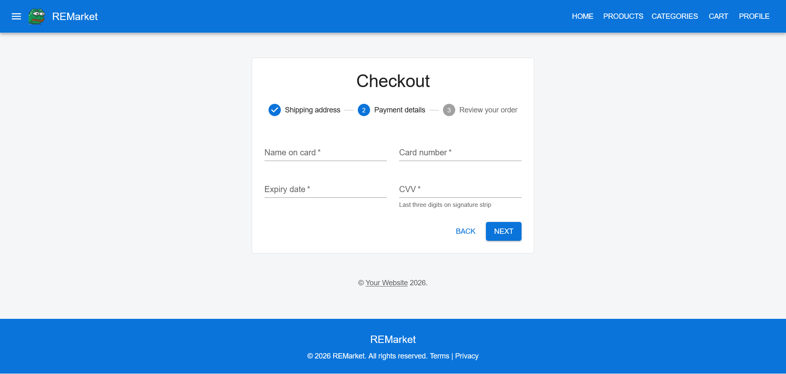
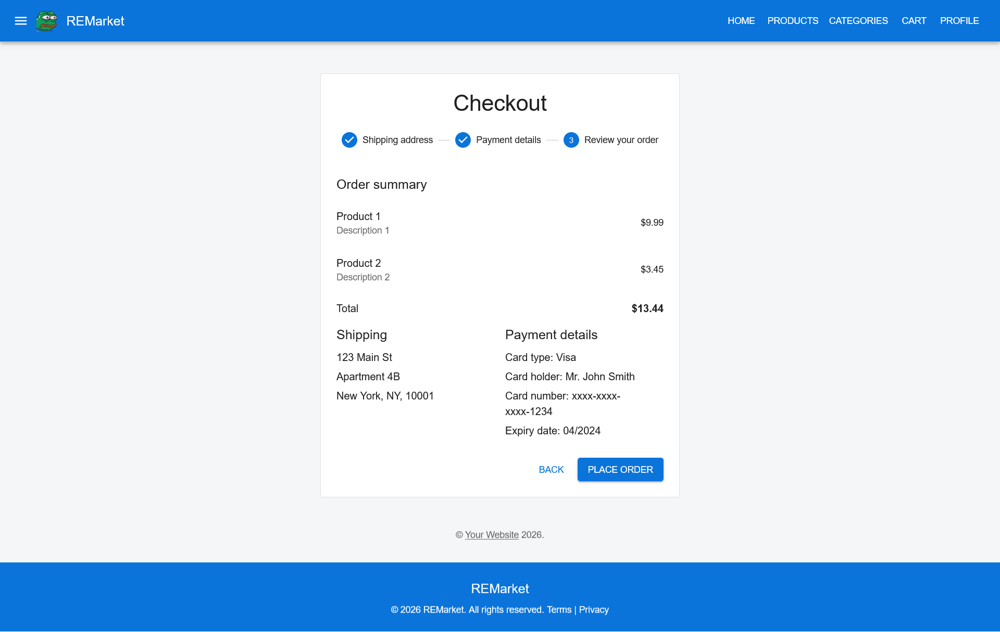
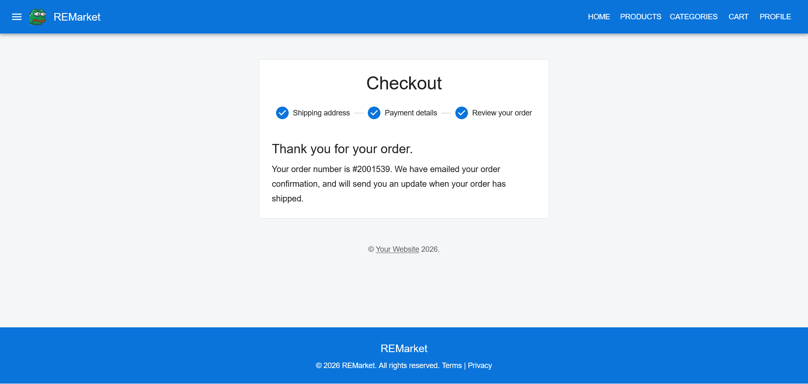
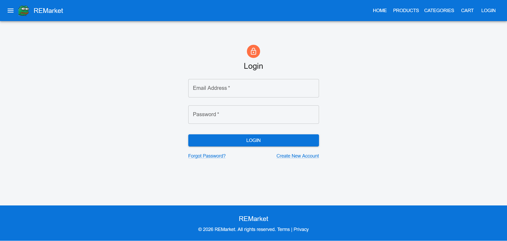
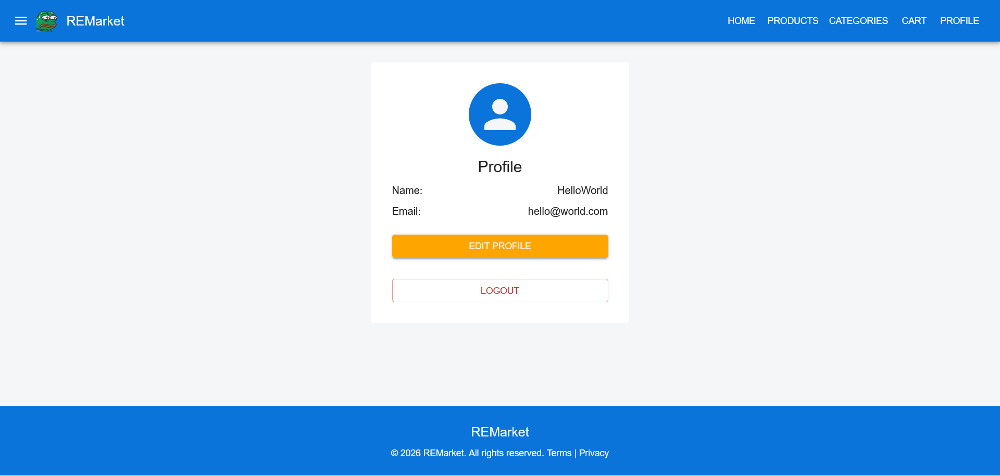
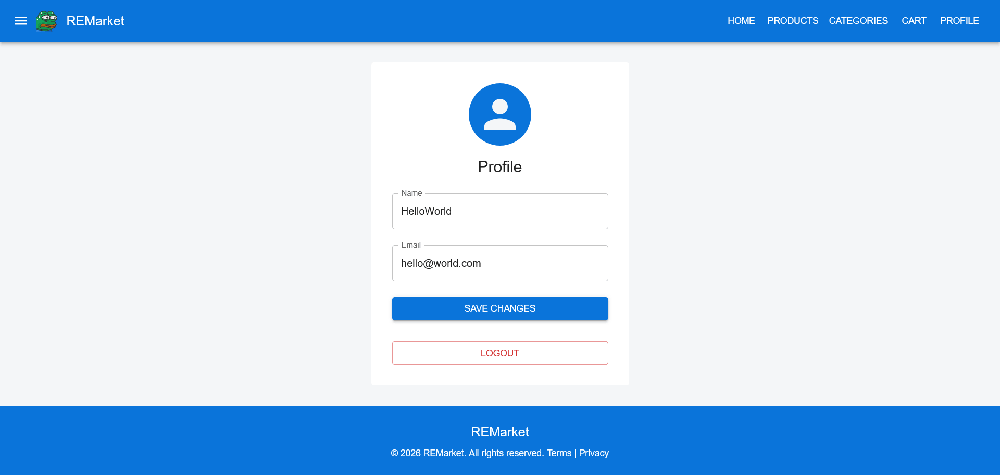

# REMarket

A full-stack MERN e-commerce platform built as a five-day practice project.  
It includes user authentication, product browsing, cart and checkout flow, profile management, and a MongoDB-backed API.

  <a href="screenshots/REMarket-Marketplace.png">
    
  </a>

## Overview

REMarket is a working online store built with a separate React frontend and Node/Express backend.  
The goal of the project was to implement a realistic e-commerce flow with authentication, product navigation, cart logic, checkout steps, and user profile actions.

## Features

- User registration and login
- Product catalog browsing
- Category-based product filtering
- Product detail cards
- Shopping cart with quantity management
- Multi-step checkout flow
- User profile view and profile editing
- REST API for users, products, and cart data
- Responsive UI built with Material UI

## Tech Stack

- Frontend: React, Vite, React Router, Material UI, Axios
- Backend: Node.js, Express
- Database: MongoDB, Mongoose
- State management: React Context API
- Authentication: JWT-based flow

## Run locally

### Backend

```bash
cd backend
npm install
npm start
```

The backend runs on:

http://localhost:5000

### Frontend
```bash
cd frontend
npm install
npm run dev
```

The frontend runs on:

http://localhost:5173


## Screenshots

### Marketplace

<div style="display: flex; flex-wrap: wrap; justify-content: center; gap: 10px;">
  <a href="screenshots/REMarket-Marketplace_products.png">
    
  </a>
  <a href="screenshots/REMarket-Marketplace_category.png">
    
  </a>
  <a href="screenshots/REMarket-Marketplace_product_card.png">
    
  </a>
</div>

### Cart and Checkout

<div style="display: flex; flex-wrap: wrap; justify-content: center; gap: 10px;">
  <a href="screenshots/REMarket-Marketplace_cart.png">
    
  </a>
  <a href="screenshots/REMarket-Marketplace_checkout1.png">
    
  </a>
  <a href="screenshots/REMarket-Marketplace_checkout2.png">
    
  </a>
  <a href="screenshots/REMarket-Marketplace_checkout3.png">
    
  </a>
  <a href="screenshots/REMarket-Marketplace_checkout4.png">
    
  </a>
</div>

### Authentication and Profile

<div style="display: flex; flex-wrap: wrap; justify-content: center; gap: 10px;">
  <a href="screenshots/REMarket-Marketplace_login.png">
    
  </a>
  <a href="screenshots/REMarket-Marketplace_Reg_1.png">
    
  </a>
  <a href="screenshots/REMarket-Marketplace_profile.png">
    
  </a>
  <a href="screenshots/REMarket-Marketplace_edit_profile.png">
    
  </a>
</div>

## Project Structure

- `frontend/` — React application  
- `backend/` — Express API and MongoDB models  
- `screenshots/` — project screenshots  

## Notes

- Frontend and backend run separately  
- Backend requires environment variables  
- Practice project (not production-ready)  
- Core flows implemented, edge cases simplified  